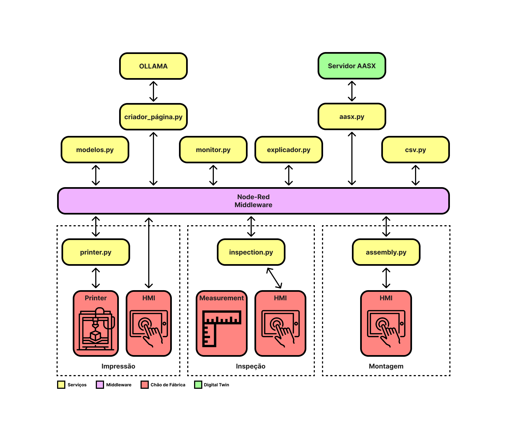

<div  align="center"> 

# ZDM4MS

## Zero Defect Manufacturing for Multi Stage Production Systems

**Muvu Technologies**

**Center of Technology and Systems (UNINOVA-CTS)**

**Parreira&Rocha**

[Mafalda Rocha (Parreira & Rocha)](),
[André Rocha (Uninova)](https://scholar.google.pt/citations?user=k1GIyqcAAAAJ&hl=pt-PT),
[Nelson Freitas (Uninova)](https://scholar.google.com/citations?user=BDOCGnoAAAAJ&hl=pt-PT),
[Raúl Dinis (Uninova)](https://www.linkedin.com/in/ra%C3%BAl-mestre-dinis/),
[Tiago Gouveia (Uninova)](),
[Bruno Silva (Muvu Technologies)](),
[António Mestre (Muvu Technologies)](),
[Dinis Faustino (Muvu Technologies)]()

<p align="center">
  
</p>

</div>

This repository holds the experimental setup for the ZDM4MS project.


## <div align="center">Demonstration Video</div>

A Video showcasing the experimental setup can be found [here](videos/ZDM4MS%20-%20Demonstração%20do%20Setup%20Experimental.mp4) or [here](https://www.youtube.com/watch?v=3W8HDcX0SLY).

---

### Project Structure
For you to better understand this repository organization here is a quick overview of its structure and where to find what you might be looking for:
```
zdm4ms
├── docs                                                    # documentation assets
├── imgs                                                    # images from this project
├── videos                                                  # videos from this project
│   └── ZDM4MS - Demonstração do Setup Experimental.mp4                 # Demonstration Video
├── src                                                     # developed code
│   ├── PythonScripts                                                   # developed modules
│   ├── Extra                                                           # extra scripts, templates and backups for support
│   ├── hmis                                                            # hmi unity projects
│   └── data folders                                                    # folders where modules have their data
└── README.md                                               # this file
```

## <div align="center">Documentation</div>

<p align="center">
  
</p>

The microservices for all the components present in the architecture are explained in the sections below.

### Middleware Services

All services were implemented using a http Post request to the address:

```bibtex
http://MIDDLEWAREIP:1880
```

#### /printer/start

Starts the printing process


```json
{
  "username": "git-user",
  "theme": "dark"
}
```

#### /printer/sub

Subscribes the middleware to a printers websocket and starts buffering the data.
<div align="center">
Request body template
</div>

```json
{
  "destination": "IP_PRINTER",
  "username": "USERNAME_OCTOPI",
  "key": "APIKEY_OCTOPI"
}
```

<div align="center">
Request body example
</div>

```json
{
  "destination": "192.168.6.1",
  "username": "rics",
  "key": "-cqzgIHdAaLvW-9EbK6dXW5019dvLPgNyxP7tEwscFw"
}
```
<div align="center">
Response
</div>

```json
200
Websocket connected
```

#### /printer/unsub

Unsubscribes the middleware to the current printers websocket and stops the printer data buffer.

<div align="center">
Request body template
</div>

```json
{
  "destination": "IP_PRINTER"
}
```

<div align="center">
Request body example
</div>

```json
{
  "destination": "192.168.6.1"
}
```
<div align="center">
Response
</div>

```json
200
Websocket disconnected
```

#### /csv/get

Gets the data inside the .

<div align="center">
Request body template
</div>

```json
{
  "destination": "IP_CSV",
  "msg": {
		"start_time": "YYYY-MM-DD HH:MM:SS"
	}
}
```

<div align="center">
Request body example
</div>

```json
{
  "destination": "192.168.250.130:5004",
  "msg": {
		"start_time": "2025-10-27 20:11:00"
	}
}
```
<div align="center">
Response
</div>

```json
200
[
    {
        "timestamp": "2025-10-27 20:11:01",
        "temp_nozzle": 200.03,
        "temp_target_nozzle": 200.0,
        "temp_delta_nozzle": 0.030000000000001137,
        "pwm_nozzle": 72.0,
        "temp_bed": 60.0,
        "temp_target_bed": 60.0,
        "temp_delta_bed": 0.0,
        "pwm_bed": 33.0,
        "X": 121.42,
        "Y": 127.02,
        "Z": 4.0,
        "E": 1371.62,
        "speed_factor": null,
        "filename": "zdm4ms~4"
    },
    {
        "timestamp": "2025-10-27 20:11:54",
        "temp_nozzle": 200.09,
        "temp_target_nozzle": 200.0,
        "temp_delta_nozzle": 0.09000000000000341,
        "pwm_nozzle": 71.0,
        "temp_bed": 60.01,
        "temp_target_bed": 60.0,
        "temp_delta_bed": 0.00999999999999801,
        "pwm_bed": 27.0,
        "X": 95.3,
        "Y": 133.04,
        "Z": 4.0,
        "E": 1379.88,
        "speed_factor": null,
        "filename": "zdm4ms~4"
    }
]
```

#### /csv/append

Gets the data inside the .

<div align="center">
Request body template
</div>

```json
{
  "destination": "IP_CSV",
  "msg": {
	  "timestamp": "TIMESTAMP",
	  "temp_nozzle": TEMP,
	  // ...
	  "filename": "FILENAME"
	}
}
```

<div align="center">
Request body example
</div>

```json
{
  "destination": "192.168.250.130:5004",
	"msg": {
		"timestamp": "2023-10-27 12:00:00",
		"temp_nozzle": 200.1, "temp_target_nozzle": 200.0, "temp_delta_nozzle": 0.1,
		"pwm_nozzle": 127, "temp_bed": 60.0, "temp_target_bed": 60.0,
		"temp_delta_bed": 0.0, "pwm_bed": 127, "X": 10.5, "Y": 20.3, "Z": 1.0, "E": 5.7,
		"speed_factor": 100.0, "filename": "zdm4ms~4"
	}
}
```
<div align="center">
Response
</div>

```json
200
{
    "success": true,
    "message": "Dados adicionados a test.csv"
}
```

#### /aas/create

Creates a new product.

<div align="center">
Request body template
</div>

```json
{
  "type": "TIPO_DA_PECA",
  "id": "ID_UNICO_DO_PRODUTO"
}
```

<div align="center">
Request body example
</div>

```json
{
  "type": "QUADRADO",
  "id": "301"
}
```
<div align="center">
Response
</div>

```json
201
```

#### /aas/update/dimensions

Creates a new product.

<div align="center">
Request body template
</div>

```json
{
  "destination": "IP_AAS",
  "shellid": "ID_PRODUTO_A_ATUALIZAR",
  "msg": {
    "comprimento": COMPRIMENTO,
    "largura": LARGURA,
    "altura": ALTURA
  }
}
```

<div align="center">
Request body example
</div>

```json
{
  "destination": "192.168.250.130:5001",
  "shellid": "301",
  "msg": {
    "comprimento": 49.5,
    "largura": 49.7,
    "altura": 10.0
  }
}
```
<div align="center">
Response
</div>

```json
200
```

#### /assembly/check

Checks the assembly of a product and its parts

<div align="center">
Request body template
</div>

```json
{
	"destination": "IP_ASSEMBLY",
	"msg": {
		"ids": ["id_peca1", "id_peca2", "id_peca3", "id_peca4", "id_caixa", "id_tampa"],
		"product_id": "ID_PRODUTO_FINAL_MONTAGEM"
	}
}
```

<div align="center">
Request body example
</div>

```json
{
  "destination": "192.168.250.130:5006",
  "msg": {
      "ids": [
          "301",
          "302",
          "303",
          "304",
          "401",
          "402"
      ],
      "product_id": "201"
  }
}
```
<div align="center">
Response
</div>

```json
200
{"message":"OK","product_id":"201"}
```

```json
200
{ "message": "NOK", "reason": "Combinação inválida...", "product_id": "201"}
```

```json
200
{ "message": "WAIT", "product_id": "201" }
```

#### /inspection/update/dimensions

Checks the assembly of a product and its parts

<div align="center">
Request body template
</div>

```json
{
	"destination": "IP_INSPECTION",
	"msg": {
		"shellid": "ID_DA_PECA_INSPECIONADA",
		"d1": COMPRIMENTO,
		"d2": LARGURA,
		"d3": ALTURA
	}
}
```

<div align="center">
Request body example
</div>

```json
{
    "destination": "192.168.250.130:5007",
    "msg": {
        "shellid": "301",
        "d1": 50.05,
        "d2": 49.98,
        "d3": 10.01
    }
}
```
<div align="center">
Response
</div>

```json
200
{ "message": "Dados enviados com sucesso para o middleware." }
```

#### /model/explain4

Checks the assembly of a product and its parts

<div align="center">
Request body template
</div>

```json
{
	"destination": "IP_INSPECTION",
	"msg": {
		{
        "timestamp": "2025-10-27 19:54:35",
        "temp_nozzle": double,
        "temp_target_nozzle": duble,
        "temp_delta_nozzle": double,
        "pwm_nozzle": double,
        "temp_bed": double,
        "temp_target_bed": double,
        "temp_delta_bed": double,
        "pwm_bed": double,
        "X": double,
        "Y": double,
        "Z": double,
        "E": double,
        "speed_factor": null,
        "filename": "<GCODE>"
    },
	}
}
```

<div align="center">
Request body example
</div>


```json
{
  "destination": "192.168.2.90:5005",
  "msg": [
    {
        "timestamp": "2025-10-27 19:54:35",
        "temp_nozzle": 199.97,
        "temp_target_nozzle": 200.0,
        "temp_delta_nozzle": -0.030000000000001137,
        "pwm_nozzle": 73.0,
        "temp_bed": 59.99,
        "temp_target_bed": 60.0,
        "temp_delta_bed": -0.00999999999999801,
        "pwm_bed": 37.0,
        "X": 131.42,
        "Y": 128.23,
        "Z": 4.2,
        "E": 1398.37,
        "speed_factor": null,
        "filename": "zdm4ms~4"
    },
    {
        "timestamp": "2025-10-27 19:54:35",
        "temp_nozzle": 199.97,
        "temp_target_nozzle": 200.0,
        "temp_delta_nozzle": -0.030000000000001137,
        "pwm_nozzle": 73.0,
        "temp_bed": 59.99,
        "temp_target_bed": 60.0,
        "temp_delta_bed": -0.00999999999999801,
        "pwm_bed": 37.0,
        "X": 130.07,
        "Y": 125.82,
        "Z": 4.2,
        "E": 1398.47,
        "speed_factor": null,
        "filename": "zdm4ms~4"
    },
    {
        "timestamp": "2025-10-27 19:54:35",
        "temp_nozzle": 199.97,
        "temp_target_nozzle": 200.0,
        "temp_delta_nozzle": -0.030000000000001137,
        "pwm_nozzle": 73.0,
        "temp_bed": 59.99,
        "temp_target_bed": 60.0,
        "temp_delta_bed": -0.00999999999999801,
        "pwm_bed": 37.0,
        "X": 128.76,
        "Y": 122.81,
        "Z": 4.2,
        "E": 1398.58,
        "speed_factor": null,
        "filename": "zdm4ms~4"
    }
  ]
}
```

<div align="center">
Response
</div>

```json
200
{ "message": "Dados enviados com sucesso para o middleware." }
```

#### /inspection/update/dimensions

Checks the assembly of a product and its parts

<div align="center">
Request body template
</div>

```json
{
	"destination": "IP_INSPECTION",
	"msg": {
		"shellid": "ID_DA_PECA_INSPECIONADA",
		"d1": COMPRIMENTO,
		"d2": LARGURA,
		"d3": ALTURA
	}
}
```

<div align="center">
Request body example
</div>

```json
{
    "destination": "192.168.250.130:5007",
    "msg": {
        "shellid": "301",
        "d1": 50.05,
        "d2": 49.98,
        "d3": 10.01
    }
}
```
<div align="center">
Response
</div>

```json
200
{ "message": "Dados enviados com sucesso para o middleware." }
```


## <div align="center">Contacts</div>
For any questions regarding this or any other project please contact us at novaricsopenlab@gmail.com or enroll in our [Discussion Forum](https://github.com/NOVA-RICS-Open-Lab/zdm4ms/discussions).
